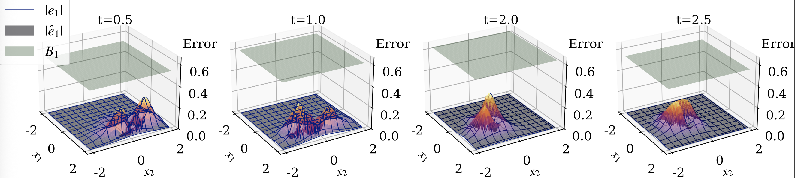
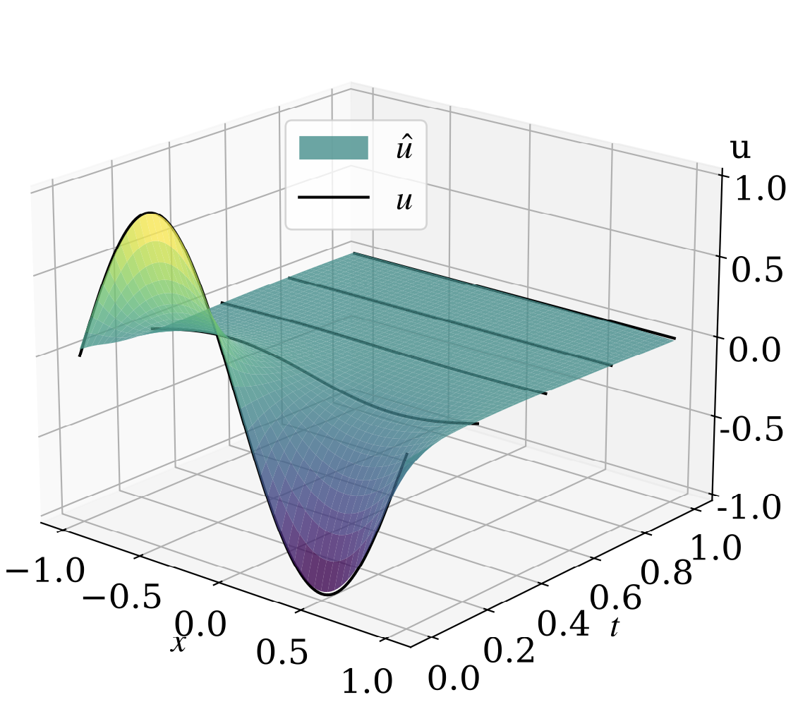
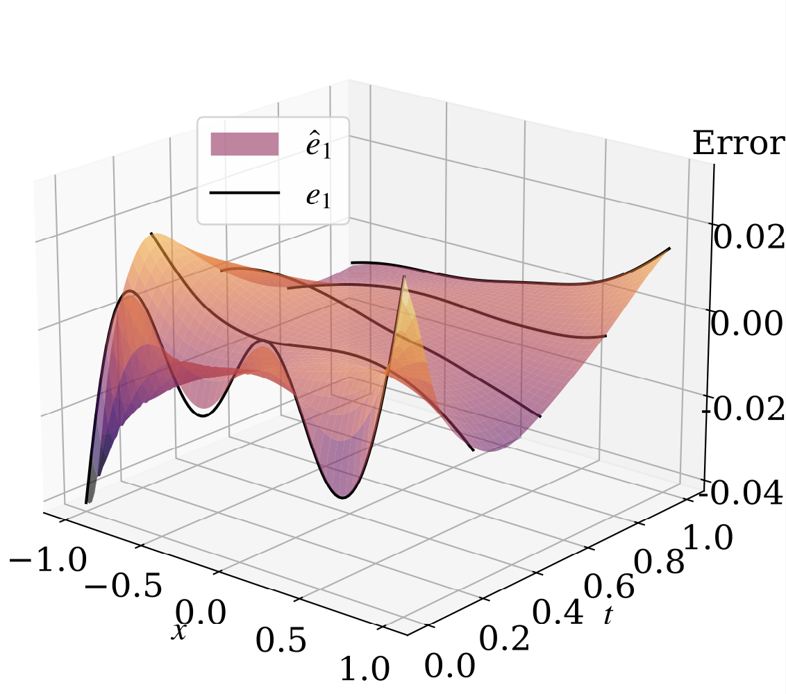

# Error Bounds for Physics-Informed Neural Networks in Fokker-Planck PDEs

Our recent research "[Error Bounds for Physics-Informed Neural Networks in Fokker-Planck PDEs](https://openreview.net/forum?id=qjzjZCLkZA)", explores solving the Fokker-Planck PDE.
The Fokker-Planck PDE represents the time-evolving probability density function (PDF) of uncertain physical processes, modeled as stochastic differential equaitons (SDEs).

We approximate the solution to Fokker-Planck PDE by physics-informed neural networks (PINNs) and construct tight error bounds.
Here, we provide some small-scale examples.

## Prerequisites

The project is built on MacbookPro M2 chip. 
Make sure you have the following installed on your system:

- Python 3.12.2
- pip3 (python package manager)

## Installation

Follow these steps to set up your environment:

1. **create python virtual environment** run: python3 -m venv venv
2. **activate python virtual environment** run: source venv/bin/activate
3. **install required packages** run: pip3 install -r requirements.txt

## PDF Evolution in time with Error Bound
1D Nonlinear example


https://github.com/user-attachments/assets/bb7b200d-7ce6-4bec-9ca0-ec4c11409ec7


## Running Examples

### 1D OU process
The models are stored in the folder: examples/1d_ou/output/

The plots are saved in the folder: examples/1d_ou/figs/

- cd examples/1d_ou
- python main.py --train=0 (this will generate plots using pretrained models)
- python main.py --train=1 (this will train the models and generate plots)

<!-- ### 1D State-dependent Dynamics
The models are stored in the folder: examples/1d_statedepend/exp1/main/output/

The plots are saved in the folder: examples/1d_statedepend/exp1/main/figs/

- cd examples/1d_statedepend
- python main.py --train=0 (this will generate plots using pretrained models)
- python main.py --train=1 (this will train the models and generate plots) -->

### 1D Nonlinear Dynamics
The models are stored in the folder: examples/1d_nonlinear/exp1/main_stat/output/

The plots are saved in the folder: examples/1d_nonlinear/exp1/main_stat/figs/

The data (of the Monte-Carlo simulation for "true" solution) is in the folder: examples/1d_nonlinear/exp1/data/

- cd examples/1d_nonlinear
- python main_stat.py --train=0 (this will generate plots using pretrained models)
- python main_stat.py --train=1 (this will train the models and generate plots)

### 2D Nonlinear Inverted Pendulum
The models are stored in the folder: examples/2d_nonlinear/exp1/main_stat/output/

The plots are saved in the folder: examples/2d_nonlinear/exp1/main_stat/figs/

The data (of the Monte-Carlo simulation for "true" solution) is in the folder: examples/2d_nonlinear/exp1/data/

- cd examples/2d_nonlinear
- python main_stat.py --train=0 (this will generate plots using pretrained models)
- python main_stat.py --train=1 (this will train the models and generate plots)

### 2D Chaotic Duffing Oscillator
The models are stored in the folder: examples/2d_duffing/exp/1/output/

The plots are saved in the folder: examples/2d_duffing/exp/1/figs/

The data (of the Monte-Carlo simulation for "true" solution) is in the folder: examples/2d_duffing/exp/1/data/

- cd examples/2d_nonlinear
- python main.py --train=0 (this will generate plots using pretrained models)
- python main.py --train=1 (this will train the models and generate plots)

example figure of the constructed time-evolving error bound




### 1D Heat Equation
The models are stored in the folder: examples/1d_heat/output/

The plots are saved in the folder: examples/1d_heat/figs/

- cd examples/1d_heat
- python main.py (this will and generate plots using the pre-trained model)

You can uncomment the train_p_net() and train_e1_net() in main to train new models.

example figures of the PINN solution $\hat{u}$ and error $\hat{e}_1$ approximations

 

### 3D, 7D, 10D Time-varying OU processes
The models are stored in the folder: examples/10d_linear/exp/(3d_2,7d_2,10d_2)/output/

The plots are saved in the folder: examples/10d_linear/exp/(3d_2,7d_2,10d_2)/figs/

The data "true" solution" is computed by semi-analytical simulation.

- cd examples/10d_linear
- python main_3d_time.py --train=0 (this will generate plots using pretrained models)
- python main_3d_time.py --train=1 (this will train the models and generate plots)
- change the name (main_3d_time) to (main_7d_time) or (main_10d_time) to run higher-D examples.

Note that for 7D and 10D examples, it will take awhile to run since we are generating 10e+7 samples for evaluation.

## Citation

If you use this work, please cite:

Kong, C.-W., Laurenti, L., McMahon, J., & Lahijanian, M.
*Error Bounds for Physics-Informed Neural Networks in Fokker-Planck PDEs*.
In **Proceedings of the 41st Conference on Uncertainty in Artificial Intelligence (UAI)**.

```bibtex
@inproceedings{kongerror,
  title={Error Bounds for Physics-Informed Neural Networks in Fokker-Planck PDEs},
  author={Kong, Chun-Wei and Laurenti, Luca and McMahon, Jay and Lahijanian, Morteza},
  booktitle={The 41st Conference on Uncertainty in Artificial Intelligence}
}


